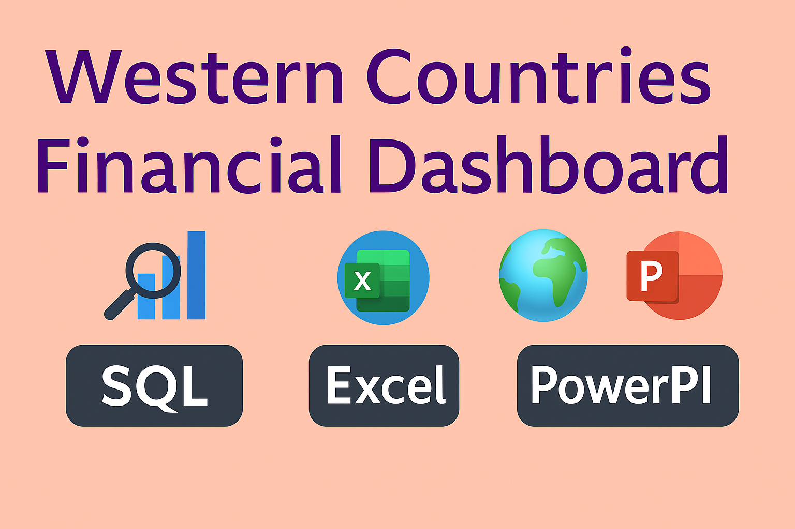

📊 Western Countries Financial Dashboard – Capstone Project
An end-to-end business analytics solution developed using Excel, SQL Server, Power BI, and presented via PowerPoint, focused on uncovering key sales and profit drivers across Western markets.

🔍 Project Summary
“Although overall sales are strong and market reach is diverse, profit margins vary significantly across segments and products. This project aims to identify actionable insights to improve profitability without sacrificing sales volume.”

📁 Files Included :
📄 Excel Dashboard – Interactive KPI cards, slicers, and trend visuals

🧮 SQL Script – Data cleaning, column derivation, and business logic queries

📈 Power BI Report – Visual insights with drill-down filters and segment-level analytics

📊 PowerPoint – Business summary with recommendations, product insights, and strategic focus

🔧 Tools & Technologies
-Excel – PivotTables, charts, slicers, KPIs

-SQL Server – Data transformation, custom columns (e.g., Estimated GDP)

-Power BI – Dashboarding, DAX, and visual storytelling

-PowerPoint – Final stakeholder presentation

🔑 Key Insights
      Topic	                                Insight
🏆 Top Product	                      Paseo – highest in sales & profit
  🏢 Best Segment	                    Government – most profitable ($11M+)
🌍 Top Countries	                    France & Germany – leading in profit (~$4M each)
📉 Low-Performing Segment	            Enterprise – consistent losses, especially with Carretera & Velo
💸 Discounts Impact	                  $95M in discounts drove $118M+ in sales – needs further margin analysis

🎯 Strategic Recommendations
>Focus growth on Government and Small Business segments

>Re-evaluate Enterprise pricing and product fit

>Boost sales of high-profit, moderate-volume products like Amarilla

>Maintain inventory for Velo, Montana, and Paseo

>Strengthen reach in France, Germany, and the U.S.

🧪 SQL Query Samples

-- Countries with highest estimated GDP in 2014
SELECT Country, SUM(Sales + Profit) AS EstimatedGDP
FROM [dbo].[Main data$]
WHERE Year = 2014
GROUP BY Country
ORDER BY EstimatedGDP DESC

-- Segment with highest average Profit per Unit Sold in 2014
SELECT TOP 1 Segment, AVG(Profit / [Units Sold]) AS AvgProfitPerUnit
FROM [dbo].[Main data$]
WHERE YEAR(Date) = 2014
GROUP BY Segment
ORDER BY AvgProfitPerUnit DESC

✅ How to Run
>Load the SQL script to create the database & import data

>Connect Power BI to the SQL table using Get Data → SQL Server

>Open the Excel file to explore charts, slicers, and KPIs

>Open the PowerPoint to view presentation-ready insights

#ExcelDashboard #SQLAnalysis #PowerBI #CapstoneProject #DataVisualization #BusinessAnalytics

